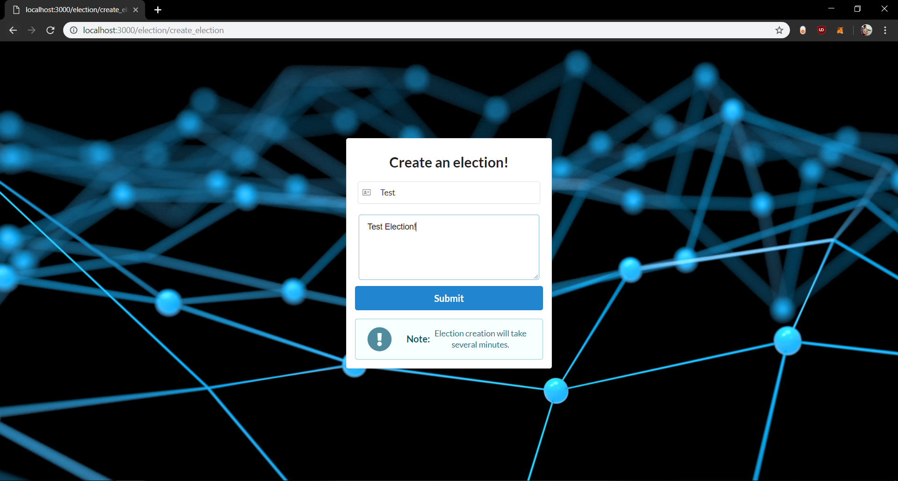
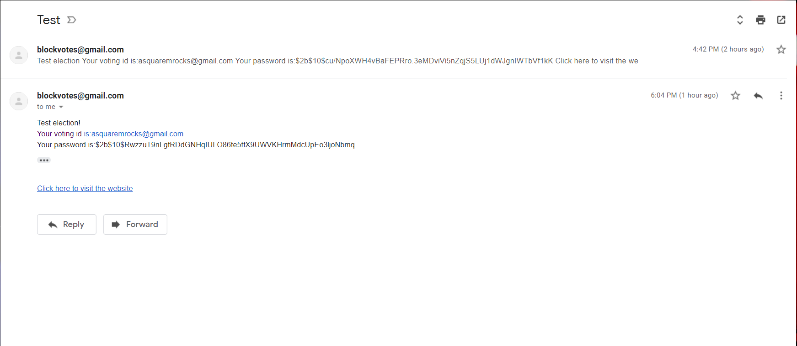
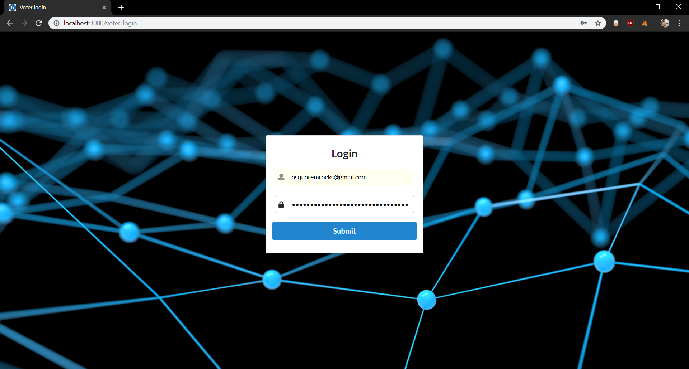
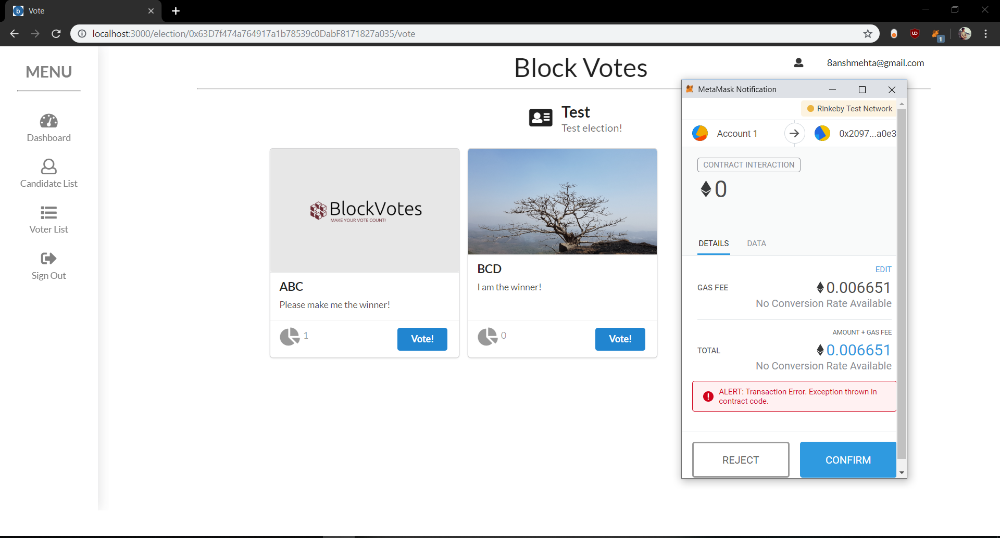
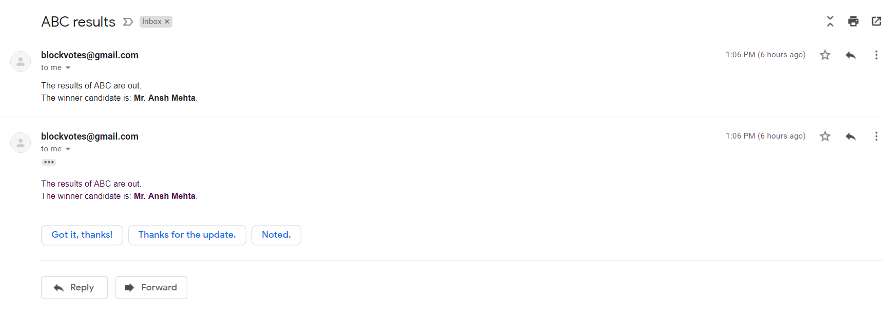

# Blockchain-Based E-Voting System

## 📋 Overview

A secure, decentralized electronic voting system built on blockchain technology. This final year project was developed by students of Shri Bhagubhai Mafatlal Polytechnic, featuring a robust architecture that ensures transparency, immutability, and security in the voting process.

## ✨ Features

- **Blockchain-Powered Voting**: Immutable and transparent voting records using Ethereum smart contracts
- **Secure Authentication**: Company and voter login systems with email verification
- **Automated Notifications**: Email alerts for candidate registration and voting results
- **IPFS Integration**: Decentralized storage for candidate images
- **User-Friendly Interface**: Modern UI built with Next.js and Semantic UI React
- **Real-time Updates**: Hot reloading for seamless development experience

## 🛠️ Technology Stack

### Frontend
- **Next.js** - React framework for server-side rendering
- **Semantic UI React** - Component library for responsive design
- **Web3.js** - Ethereum blockchain interaction

### Backend
- **Node.js** (v11.14.0) - JavaScript runtime
- **Express.js** - Web application framework
- **MongoDB** - NoSQL database for user data
- **Mongoose** - MongoDB object modeling

### Blockchain
- **Solidity** - Smart contract development
- **Ethereum** - Blockchain platform
- **MetaMask** - Ethereum wallet integration

### Storage
- **IPFS** - Decentralized file storage for candidate images

## 🚀 Installation & Setup

### Prerequisites

1. **Node.js v11.14.0** (Critical for compatibility)
   ```bash
   # Using nvm (recommended)
   nvm install 11.14.0
   nvm use 11.14.0
   ```

2. **MongoDB** - Ensure it's running on `localhost:27017`
   ```bash
   # Linux/Mac
   sudo service mongod start
   
   # Windows
   net start MongoDB
   ```

3. **MetaMask Extension** - Install from [metamask.io](https://metamask.io/download.html)
   - Create an Ethereum wallet
   - Get test Ether from [Rinkeby Faucet](https://faucet.rinkeby.io)

### Installation Steps

1. **Clone the repository**
   ```bash
   git clone https://github.com/yourusername/BlockChainVoting.git
   cd BlockChainVoting
   ```

2. **Install dependencies**
   ```bash
   npm install
   ```

3. **Configure environment variables**
   
   Create a `.env` file in the root directory:
   ```bash
   EMAIL=your_email@gmail.com
   PASSWORD=your_email_password
   ```

4. **Start the application**
   ```bash
   npm start
   ```
   The app will run at `http://localhost:3000`

## 📱 Application Screenshots

### Homepage


### Company Login


### Create Election


### Dashboard


### Candidate Management


### Candidate Notification Email


### Voter Management


### Voter Credentials Email


### Voter Login


### Successful Voting


### Unsuccessful Voting


### Winner Notification


## 👥 Team Members

- **Your Name** - Developer
- **Sayyam Gada** - Developer
- **Charmee Mehta** - Developer

## 📄 License

This project is [MIT Licensed](LICENSE) - feel free to use and modify for your own purposes.

## ⭐ Support

If this project helped you, please consider starring the repository on GitHub!

## 🔧 Troubleshooting

### Common Issues

1. **Node.js Version Error**
   - Ensure you're using Node.js v11.14.0
   - Check with `node --version`

2. **MetaMask Connection Issues**
   - Make sure MetaMask is installed and unlocked
   - Ensure you have sufficient test Ether
   - Verify Rinkeby network is selected

3. **MongoDB Connection Error**
   - Confirm MongoDB is running
   - Check if port 27017 is available
   - Try restarting MongoDB service

4. **Email Sending Issues**
   - Verify email credentials in `.env` file
   - Check if your email provider allows third-party access
   - Enable "Less secure app access" for Gmail

## 🏗️ Future Enhancements

- [ ] Support for multiple blockchain networks
- [ ] Mobile application version
- [ ] Advanced analytics dashboard
- [ ] Multi-language support
- [ ] Enhanced security features
- [ ] Offline voting capability

## 📚 Resources

- [Ethereum Documentation](https://ethereum.org/en/developers/docs/)
- [Solidity Documentation](https://docs.soliditylang.org/)
- [MetaMask Documentation](https://docs.metamask.io/)
- [IPFS Documentation](https://docs.ipfs.io/)
- [Next.js Documentation](https://nextjs.org/docs)

---

Made with ❤️ by the BlockChainVoting Team
